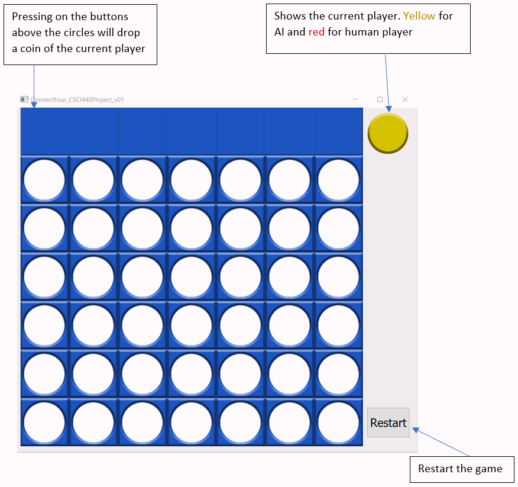

# Connect Four

This project was part of the CSCI 440 Introduction to Artificial Intelligence coursework in SCSU.

The intention of this project was to build a Connect Four game that plays against a human opponent. To achieve this, I implemented the core game mechanics in C++ and implemented the UI with the Qt library.

To determine the next winning move for the AI, I implemented a [minimax](https://www.geeksforgeeks.org/minimax-algorithm-in-game-theory-set-1-introduction/) algorithm with a static evaluation function (check below for more information on the SEF)

## Using the program:
### Download and Installation:
  - Download and extract “ConnectFour_setup.zip” file.
  - Run “setup.exe” to install the program.

### How to play:

## Design choices:

### Reason for choosing Connect Four

Unlike chess or other mildly complex games, connect four is simple, and this will help me focus on the study rather than simulating complex gameplay. There are a relatively small number of possible moves at any given point in the game, limiting the combinatorial explosion. However, the game still allows a rich depth of strategy, unlike games such as tic-tac-toe.

  - A 2D array was used to represent the board.
      | `0` | `0`  | `0`  | `0`  | `0`  | `0`  | `0`  |
      | - | - | - | - | - | - | - |
      | `0` | `0`  | `0`  | `0`  | `0`  | `0`  | `0`  |
      | `0` | `0`  | `0`  | `0`  | `0`  | `0`  | `0`  |
      | `0` | `0`  | `0`  | `0`  | `0`  | `0`  | `0`  |
      | `0` | `1`  | `2`  | `0`  | `2`  | `2`  | `0`  |
      | `1`  | `2` | `2`  | `2`  | `1` | `1`  | `1`  |
      
      (example representation of the game board)
  - 1s represent the human player, 2s represent the AI, and 0s represent the empty cells.
  - Minimax algorithm was used to determine the next move made by the AI.

### Static Evaluation function:
The static evaluation function of this game is implemented by assigning scores to each cell on the board. Those scores are based on how many four disks can be formed from that particular cell in all eight directions. The representations of the scores on the boards are shown as below.

| `3` | `4`  | `5`  | `7`  | `5`  | `4`  | `3`  |
| - | - | - | - | - | - | - |
| `4` | `6`  | `8`  | `10`  | `8`  | `6`  | `4`  |
| `5` | `8`  | `11`  | `13`  | `11`  | `8`  | `5`  |
| `5` | `8`  | `11`  | `13`  | `11`  | `8`  | `5`  |
| `4` | `6`  | `8`  | `10`  | `8`  | `6`  | `4`  |
| `3` | `4`  | `5`  | `7`  | `5`  | `4`  | `3`  |

The static evaluation function calculates the current move by looping through each cell on the scoreboard and accumulating the cell weights which belong to the AI player(2) and subtracting the cell weights that belong to the human player(1). After the algorithm iterates through the entire board, the function will return the final score. 
